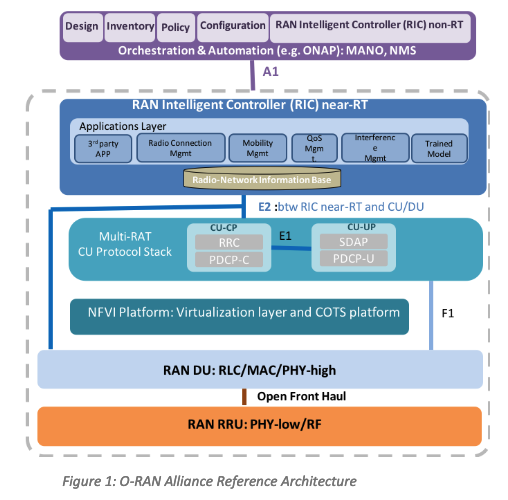

# O-RAN: Towards an Open and Smart RAN

[Source](https://assets-global.website-files.com/60b4ffd4ca081979751b5ed2/60e5afb502810a0947b3b9d0_O-RAN%2BWP%2BFInal%2B181017.pdf)

- [O-RAN: Towards an Open and Smart RAN](#o-ran-towards-an-open-and-smart-ran)
  - [Executive Summary](#executive-summary)
  - [Why O-RAN Alliance? - Trends driving the need for an operator driven industry alliance](#why-o-ran-alliance---trends-driving-the-need-for-an-operator-driven-industry-alliance)
  - [The O-RAN Alliance Vision](#the-o-ran-alliance-vision)
  - [Key work groups of the O-RAN Alliance](#key-work-groups-of-the-o-ran-alliance)
    - [The Non-real-time RAN Intelligent Controller and A1 Interface Workgroup](#the-non-real-time-ran-intelligent-controller-and-a1-interface-workgroup)
    - [The Near-real-time RIC and E2 interface Workgroup](#the-near-real-time-ric-and-e2-interface-workgroup)
    - [The Open Fronthaul Interfaces Workgroup](#the-open-fronthaul-interfaces-workgroup)
    - [The Stack Reference Design and Open F1/W1/E1/X2/Xn interface Workgroup](#the-stack-reference-design-and-open-f1w1e1x2xn-interface-workgroup)
    - [The Cloudification and Orchestration Workgroup](#the-cloudification-and-orchestration-workgroup)
    - [The White-box Hardware Workgroup](#the-white-box-hardware-workgroup)
  - [Conclusion](#conclusion)
  - [Footnotes](#footnotes)

## Executive Summary

As mobile traffic increases, mobile networks and the equipment that runs them must become more software-driven, virtualized, flexible, intelligent and energy efficient. The O-RAN Alliance is committer to evolving radio access networks - making them more open and smarter than previous generations. Real-time analytics that drive embedded machine learning systems and artificial intelligence back end modules will empower network intelligence. Additional virtualized network elements with open, standardized interfaces will be key aspects of the reference designs developed by the O-RAN Alliance. Technologies from open source and open white-box network elements will be important software and hardware components of the reference designs.

The O-RAN Alliance is in pursuit of the vision of openness and intelligence for the next generation wireless networks and beyond.

- **Openness** - Building a more cost-effective, agile RAN requires openness. Open interfaces are essential to enable smaller vendors and operators to quickly introduce their own services, or enables operators to customize the network to suit their own unique needs. Open interfaces also enable multi-vendor deployments, enabling a more competitive and vibrant supplier ecosystem. Similarly, open source software and hardware reference designs enable faster, more democratic and permission-less innovation.
- **Intelligence** - Networks will become increasingly complex with the advent of 5G, densification and richer and more demanding applications. To tame this complexity, we cannot use traditional human intensive means of deploying, optimizing and operating a network. Instead, networks must be self-driving, they should be able to leverage new learning based technologies to automate operational network functions and reduce OPEX. The O-RAN alliance will strive to leverage emerging deep learning techniques to embed intelligence in every layer of the RAN architecture. Embedded intelligence, applied at both component and network levels, enables dynamic local radio resource allocation and optimizes network-wide efficiency. In combination with O-RAN's open interfaces, AI-optimized closed-loop automation is achievable and will enable a new era of network operations.

Toward this end, O-RAN Alliance is adopting the following principles.

- Leading the industry towards open, interoperable interfaces, RAN virtualization, and big data enabled RAN intelligence.
- Maximizing the use of common-off-the-shelf hardware and merchant silicon and minimizing proprietary hardware.
- Specifying APIs and interfaces, driving standards to adopt them as appropriate, and exploring open source where appropriate.

This white paper will provide readers with valuable insight into the motivation and plans of the O-RAN Alliance including:

- Challenges with conventional RAN,
- The vision for the future, and objectives for the Alliance
- The O-RAN Architecture
- Planned workgroup focus

## Why O-RAN Alliance? - Trends driving the need for an operator driven industry alliance

The mobile industry is at a tipping point. At the end of 2017, there were 4.8 billion unique mobile subscribers representing 65% of the world’s population, but mobile subscriber growth is slowing to a compound annual growth rate of 4.2% over the next few years to 2020, according to (GSMA, 2017); so revenue growth is limited. But, the volume and variety of mobile traffic continues to surge. According to (Cisco, 2018), mobile data traffic will increase sevenfold between 2016 and 2021, growing at a 47% annual growth rate. The number of Internet of Things (IoT)connected devices is also rapidly increasing. (Gartner, 2017). At the same time, 5G network capabilities are pioneering ultra low-latency (ULL) applications and, for the first time, massive machine-type communications, which will drive the volume and variety of data traffic ever higher.

Mobile operators are under pressure to meet this increasing capacity demand while containing costs and launching new offerings in highly competitive mobile services markets. Something must give. Operators cannot carry on business-as-usual and expect to meet surging bandwidth demand, compete with web-scale rivals and prepare for a 5G future. The cost-per bit model must change and revenue generating services must be explored.

These trends have spurred significant change in the network core recently with the advent of SDN[^1] and NFV[^2], which have enabled building a more agile, less expensive network core. However, the RAN has largely remained untouched which is surprising given that the majority of the CAPEX and OPEX in building and managing networks is in the RAN. In general, its estimated that 65-70% of the total cost of ownership of a network is in the RAN.

Our goal in O-RAN is to bring a similar revolution to the RAN. First, we aim to bring cloud scale economics to the RAN. This has multiple layers, from being able to use off-the-shelf hardware to designing software in a modular fashion to enable scale out designs for capacity, reliability and availability, rather than expensive scale up designs to highly automated ways of managing and optimizing the infrastructure. These attributes have been a big source of web-services’ companies’ ability to build large scale yet cost effective clouds, and we aim to bring the same economics to the RAN.

Second, we aim to bring agility to the RAN. This has multiple layers, from being able to quickly tune the RAN to adapt to new services/applications to operators being able to tune the network to their unique needs without having to wait on vendors to deliver features to enabling smaller vendors or even operators to introduce their own products/features into the RAN without requiring significant cooperation from the traditional vendors. The eventual goal is to bring a dev ops culture to the RAN, enabling fast development, testing and iteration of the RAN stack.

[^1]: Software-Defined Networking (SDN) is a networking approach that uses a centralized software controller to manage the flow of traffic in a network, rather than relying on individual networking devices to make forwarding decisions. In an SDN environment, the networking devices (such as switches and routers) are "dumb" and simply forward traffic according to the instructions they receive from the central controller.

[^2]: Network Function Virtualization (NFV) is a networking approach that uses software to virtualize the functions of network equipment, such as routers, firewalls, and load balancers. Instead of using dedicated hardware devices to perform these functions, NFV allows them to be implemented in software that can run on industry-standard servers, making it possible to leverage the economies of scale and cost-efficiencies of the server market.

## The O-RAN Alliance Vision

The O-RAN Alliance was founded by operators to clearly define requirements and help build a supply chain eco-system to realize the above objectives. To accomplish these objectives, the O-RAN Alliance's work will embody the following two themes:

**Openness** - We cannot bring service agility and cloud scale economics to the RAN without openness. Open interfaces are essential to enable smaller vendors and operators to introduce their own services, or customize the network to suit their own unique needs. Open interfaces also enable multi-vendor deployments, enabling a more competitive and vibrant supplier ecosystem. Similarly, open source software and hardware reference designs enable faster, more democratic and permission-less innovation.

**Intelligence** - Networks will become increasingly complex with the advent of 5G, densification and richer and more demanding applications. To tame this complexity, we cannot use traditional human intensive means of deploying, optimizing and operating a network. Instead, networks must be self-driving, they should be able to leverage new learning based technologies to automate operational network functions and reduce OPEX. The O-RAN alliance will strive to leverage emerging deep learning techniques to embed intelligence in every layer of the RAN architecture. Embedded intelligence, applied at both component and network levels, enables dynamic local radio resource allocation and optimizes network-wide efficiency. In combination with open interfaces, AI-optimized closed-loop automation is achievable and will enable a new era for network operations.

O-RAN Alliance members and contributors have committed to evolving radio access networks around the world. Future RANs will be built on a foundation of virtualized network elements, white-box hardware and standardized interfaces that fully embrace O-RAN’s core principles of intelligence and openness. An ecosystem of innovative new products is already emerging that will form the underpinnings of the multi-vendor, interoperable, autonomous, RAN, envisioned by many in the past, but only now enabled by the global industry-wide vision, commitment and leadership of O-RAN Alliance members and contributors.

The key principles of the O-RAN Alliance include:

- Lead the industry towards open, interoperable interfaces, RAN virtualization, and big data enabled RAN intelligence.
- Specify APIs and interfaces, driving standards to adopt them as appropriate, and exploring open source where appropriate.
- Maximize the use of common-off-the-shelf hardware and merchant silicon and minimizing proprietary hardware.

In line with the principles, the O-RAN alliance’s workgroups will focus on the following fundamental dimension:

**Software Defined, AI enabled RAN Intelligent Controller.** A key principle of the O-RAN architecture is to extend SDN concept of decoupling the control- plane (CP) from the user-plane (UP) into RAN while bringing in embedded intelligence. This extends the CP/UP split of CU, being developed within 3GPP through the E1[^3] interface, and further enhances the traditional RRM functions with embedded intelligence by introducing the hierarchical (Non-RT and Near-RT) RAN Intelligent Controller (RIC) with the A1[^4] and E2[^5] interfaces.

The first benefit decoupling offers is to allow the UP[^6] to get more standardized, since most of the variability is in the CP[^7]. This allows easy-scaling and cost-effective solutions for the UP. The second benefit is to allow for advanced control functionality, which delivers increased efficiency and better radio resource management. These control functionalities will then leverage analytics and data-driven approaches including advanced ML/AI tools.

**RAN Virtualization.** RAN cloudification is one of the fundamental tenets of the O-RAN architecture. Operators are delivering NFVI/VIM[^8] requirements to enhance virtualization platforms in support of various splits. For example: high layer split between PDCP[^9] and RLC[^10], low layer split within PHY[^11]. Whenever possible, the O-RAN Alliance will leverage and verify the performance of relevant open source communities including - [OPNFV](https://www.opnfv.org/), [ONAP](https://www.onap.org/), [Akriano](https://www.lfedge.org/projects/akraino/), [K8S](https://kubernetes.io/), [OpenStack](https://www.openstack.org/), [QEMU](https://www.qemu.org/) - to design key solutions such as programmable hardware accelerators, real time processing, light weight virtualization technologies.

**Open Interfaces.** The O-RAN reference architecture is built on a set of key interfaces between multiple decoupled RAN components. These include enhanced 3GPP interfaces (F1, W1, E1, X2, Xn[^12]) for true multi-vendor interoperability. Additional O-RAN Alliance specified interfaces include an open fronthaul interface between the DU and RRU, an E2 interface, and an A1 interface between orchestration/NMS layer containing the non-real-time RIC (RIC non-RT) function and the eNB/gNB containing the near-real-time RIC (RIC near-RT) function.

**White box hardware.** To take full advantage of the economies of scale offered by an open computing platform approach, O-RAN Alliance reference designs will specify high performance, spectral and energy efficient white-box base station hardware. Reference platforms support a decoupled approach and offer detailed schematics for hardware and software architecture to enable both the BBU and RRU.

**Open Source software.** The O-RAN Alliance understands the value and supports the goals and objectives of open source communities. Many components of the O-RAN architecture will be delivered as open source, through existing communities. These components include: the RAN intelligent controller, protocol stack, PHY layer processing and virtualization platform. The O-RAN open-source software framework will not only implement the de facto interfaces, including F1/W1/E1/E2/X2/Xn, but also expects to offer the reference design for next generation RRM with embedded intelligence to enable the RIC.

The O-RAN Reference Architecture is designed to enable next generation RAN infrastructures. Empowered by principles of intelligence and openness, the O-RAN architecture is the foundation for building the virtualized RAN on open hardware, with embedded AI-powered radio control, that has been envisioned by operators around the globe. The architecture is based on well-defined, standardized interfaces to enable an open, interoperable supply chain ecosystem in full support of and complimentary to standards promoted by 3GPP and other industry standards organizations.

The salient features and functional modules of the O-RAN reference architecture include:

**RAN Intelligent Controller (RIC) non-Real Time (non-RT) layer**

Non-RT control functionality (> 1s) and near-Real Time (near-RT) control functions (< 1s) are decoupled in the RIC. Non-RT functions include service and policy management, RAN analytics and model-training for the near-RT RAN functionality. Trained models and real-time control functions produced in the RIC non-RT are distributed to the RIC near-RT for runtime execution.

_Relevant interface_ - A1 is the interface between Orchestration/NMS layer containing RIC non-RT and eNB/gNB containing RIC near-RT. With the introduction of A1, network management applications in RIC non-RT are able to receive and act on highly reliable data from the modular CU and DU in a standardized format. Messages generated from AI-enabled policies and ML-based training models in RIC non-RT are conveyed to RIC near-RT. The core algorithm of RIC non-RT is developed and owned by operators. It provides the capability to modify the RAN behaviors by deployment of different models to individual operator policies and optimization objectives.

**RAN Intelligent Controller (RIC) near-Real Time (near-RT) layer**

The O-RAN reference architecture provides next generation RRM with embedded intelligence, while optionally accomodating legacy RRM. RIC near-RT is completely compatible with legacy RRM and begins by enhancing well understood, but operational challenging functions such as per-UE controlled load-balancing, RB management, interference detection and mitigation. In addition, it provides new functions leveraging embedded intelligence, such as QoS management, connectivity management and seamless handover control. The RIC near-RT delivers a robust, secure and scalable platform that allows for flexible on-boarding of third-party control-applications. RIC near-RT functions leverages a database called the Radio-Network Information Base (R-NIB) which captures the near real-time state of the underlying network with E2 and commands from RIC non-RT via A1.

_Relevant interfaces_ (A1 & E2) - A1, as described above, is the interface between RIC non-RT and modular CU which contains RIC near-RT. E2 is the interface between the RIC near-RT and the Multi-RAT CU protocol stack and the underlying RAN DU. Originated from the interface between legacy RRM and RRC in traditional systems, the E2 delivers a standard interface between the RIC near-RT and CU/DU in the context of an O-RAN architecture. While the E2 interface feeds data, including various RAN measurements, to the RIC near-RT to facilitate radio resource management, it is also the interface through which the RIC near-RT may initiate configuration commands directly to CU/DU.

The RIC near-RT can be provided by traditional TEMs or 3rd-party players. While receiving and AI model from RIC non-RT, RIC near-RT will execute the new models (including, but not limited to traffic prediction, mobility track prediction and policy decisions) to change the functional behavior of the network and applications the network supports.

**Multi-RAT CU protocol stack and platform**

The function of the Multi-RAT protocol stack supports 4G, 5G and other protocol processing. The basic functions of the protocol stack are implemented according to the control commands issued by the RIC near-RT module (for example: handovers). Virtualization delivers a highly-efficient execution environment for CU and RIC near-RT, providing the ability to distribute capacity across multiple network elements with security isolation, virtual resource allocation, accelerator resource encapsulation, among other benefits.

_Relevant interfaces_ - The existing interface definitions for F1/W1/E1/X2/Xn provided by 3GPP, will be enhanced to support interoperation among multi-vendors and the CU provided by TEMs offer a regional CP and UP anchor for DUs.

**DU and RRU Function definition**

The DU and RRU function includes real-time L2 functions, baseband processing and radio frequency processing.

_Relevant interface_ - The interface between the DU and the RRU provides standard function segmentation, including the DU-RRI lower layer split interface (Open Fronthaul Interface), and the CU-DU higher layer split interface (F1), which ensures interoperability between different TEMs.

[^3]: E1: The E1 interface is a standard for digital communication at a rate of 2.048 megabits per second. 

    It is used in various applications, including telecommunications and data transmission. 
    In telecommunications, the E1 interface is commonly used to connect telephone exchanges (also known as central offices) to each other, as well as to connect exchanges to other network elements, such as gateways and media servers. It can also be used to connect customer premises equipment (CPE), such as PBX systems, to the telephone network.

    In data transmission, the E1 interface is often used to connect data networking equipment, such as routers and switches, to each other and to other network elements. It can also be used to connect customer premises equipment, such as LANs and WANs, to the data network.

    The E1 interface uses a time-division multiplexing (TDM) technique to transmit data over a pair of copper wires or a fiber optic link. It is designed to operate over distances of up to about 50 kilometers (30 miles) and is commonly used in both point-to-point and point-to-multipoint configurations.

[^4]: The A1 interface is a signaling interface in the 3GPP (3rd Generation Partnership Project) standards for mobile telecommunications. It is used to support the exchange of signaling messages between the Mobile Station (MS) and the Mobile Switching Center (MSC) in a 2G (GSM, IS-136) or 3G (UMTS) network.

    The A1 interface is a logical interface that is realized over the physical air interface, which is the point of connection between the MS and the RAN (Radio Access Network). The A1 interface is responsible for the exchange of signaling messages that are used to set up and release calls and other services between the MS and the MSC.

    In a GSM network, the A1 interface is also known as the Um interface. In a UMTS network, it is known as the Iu-CS interface. The A1 interface is defined in the 3GPP TS 24.008 specification.

[^5]: The E2 interface is a signaling interface in the 3GPP (3rd Generation Partnership Project) standards for mobile telecommunications. It is used to support the exchange of signaling messages between the Mobile Switching Center (MSC) and the Visitor Location Register (VLR) in a 2G (GSM, IS-136) or 3G (UMTS) network.

    The E2 interface is a logical interface that is realized over the physical A interface, which is the point of connection between the MSC and the VLR. The E2 interface is responsible for the exchange of signaling messages that are used to update the VLR with information about the location and status of mobile subscribers that are currently served by the MSC.

    In a GSM network, the E2 interface is also known as the A interface. In a UMTS network, it is known as the Iu-CS interface. The E2 interface is defined in the 3GPP TS 29.002 specification.

[^6]: The user plane is responsible for carrying the actual user data and traffic through the network. It is the plane of communication that is used to transmit data between devices and users.

[^7]: The control plane is responsible for managing the network and maintaining its overall health. It does this by exchanging control messages with other devices in the network in order to establish and maintain communication between them. The control plane is responsible for routing traffic, establishing connections, and ensuring that the network is running smoothly.

[^8]: NFVI (Network Function Virtualization Infrastructure) is a set of hardware and software resources that are used to support the virtualization of network functions. It provides the underlying infrastructure for running virtualized network functions, such as virtual routers, switches, and firewalls.

    VIM (Virtualized Infrastructure Manager) is a component of the NFVI that is responsible for managing the virtualized infrastructure and resources. It provides the management functions required to deploy, operate, and maintain virtualized network functions.

[^9]: PDCP (Packet Data Convergence Protocol) is a protocol used in 3GPP (3rd Generation Partnership Project) cellular networks to provide header compression and security for user plane data. It is used in the radio access network (RAN) to compress and decompress the headers of data packets before they are transmitted over the air interface between the base station and the mobile device.

[^10]: RLC (Radio Link Control) is a protocol used in 3GPP (3rd Generation Partnership Project) cellular networks to provide reliable data transmission over the air interface between the base station and the mobile device. It is part of the data link layer of the OSI (Open Systems Interconnection) model, and it operates between the MAC (Media Access Control) layer and the PDCP (Packet Data Convergence Protocol) layer in the RAN (Radio Access Network).

[^11]: PHY (Physical Layer) is the lowest layer of the OSI (Open Systems Interconnection) model, and it is responsible for transmitting raw data over a physical medium, such as a cable or an air interface. The PHY layer is responsible for providing the physical connection between devices and converting the data into a form that can be transmitted over the medium.

[^12]: In 3GPP (3rd Generation Partnership Project) cellular networks, there are several interfaces that are used to connect various network components and enable communication between them. These interfaces include:

    F1: The F1 interface is used to connect the radio access network (RAN) to the core network. It is used to transport user plane data and control plane signaling between the RAN and the core network.

    W1: The W1 interface is used to connect the RAN to the core network in wireless systems that use a different air interface from that of the F1 interface.

    E1: The E1 interface is used to connect the RAN to the core network in systems that use a wired connection. It is commonly used in fixed line systems, such as DSL (Digital Subscriber Line) and POTS (Plain Old Telephone Service).

    X2: The X2 interface is used to connect two base stations in the same or different RANs. It is used to support inter-base station communication and handover of mobile devices between base stations.

    Xn: The Xn interface is used to connect the RAN to non-3GPP networks, such as WiFi or satellite networks. It is used to support interworking between 3GPP and non-3GPP networks.

## Key work groups of the O-RAN Alliance 

### The Non-real-time RAN Intelligent Controller and A1 Interface Workgroup

### The Near-real-time RIC and E2 interface Workgroup 

### The Open Fronthaul Interfaces Workgroup

### The Stack Reference Design and Open F1/W1/E1/X2/Xn interface Workgroup

### The Cloudification and Orchestration Workgroup

### The White-box Hardware Workgroup

## Conclusion

As mobile traffic increases, mobile networks and the equipment that runs them must become more software-driven, virtualized, flexible, intelligent and energy efficient. The O-RAN Alliance is committed to evolving radio access networks - making them more open and smarter than previous generations. Real-time analytics that drive embedded machine learning systems and artificial intelligence back end modules will empower network intelligence. Additional virtualized network elements with open, standardized interfaces will be key aspects of the reference designs developed by the O-RAN Alliance. Technologies from open source and open white box network elements will be important software and hardware components of the reference designs. The O-RAN alliance community of operators and vendors will strive to lead and drive this transformation.

## Footnotes